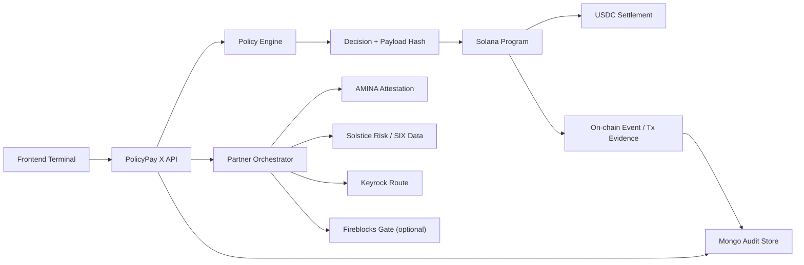

# PolicyPay X

Institutional stablecoin payments need more than a wallet transfer. Banks, custodians, and regulated issuers need programmable controls for KYC, AML, KYT, Travel Rule compliance, corridor screening, and auditability.

**PolicyPay X** is a programmable compliance and settlement layer for **institutional stablecoin payments on Solana**. It lets institutions define policy, evaluate a payment against compliance rules, and enforce that decision at settlement time so compliance is not a soft off-chain checkbox.

## Live Demo

- Frontend: [https://policypay-x-ashwin-goyals-projects.vercel.app](https://policypay-x-ashwin-goyals-projects.vercel.app)
- Backend: [http://policypayx-backend-20260329.us-east-1.elasticbeanstalk.com](http://policypayx-backend-20260329.us-east-1.elasticbeanstalk.com)
- Backend health: [http://policypayx-backend-20260329.us-east-1.elasticbeanstalk.com/health](http://policypayx-backend-20260329.us-east-1.elasticbeanstalk.com/health)

## Hackathon Fit

- Track: **Programmable Stablecoin Payments**
- Chain: **Solana**
- Institutional requirements addressed:
  - `KYC`
  - `AML`
  - `KYT`
  - `Travel Rule`
  - policy-based settlement enforcement
  - auditability for regulated workflows

## What PolicyPay X Does

1. Institutions create compliance policies with thresholds, blocked jurisdictions, and Travel Rule requirements.
2. The backend runs a payment through either:
   - a direct attestation path, or
   - an orchestrated partner path that composes AMINA, Solstice, Keyrock, and optional Fireblocks-style signals.
3. A deterministic compliance decision is produced with a reason and payload hash.
4. If allowed, the Solana program settles the payment and the system records an audit trail tied to the transaction.

## Why This Matters

Most stablecoin payment demos stop at "send USDC." Institutional reality is different:

- compliance logic must be explicit
- policy must be enforceable, not advisory
- settlement should only happen if the policy passes
- every decision should be explainable afterward

PolicyPay X turns stablecoin movement into a **policy-enforced execution flow** instead of a generic token transfer.

## Architecture



## Product Surfaces

### 1. Dashboard
- operational overview of policies, blocked corridors, and settlement outcomes
- recent audit feed and policy posture

### 2. Policy Registry
- create and view policy sets
- configure:
  - max amount
  - KYC requirement
  - AML threshold
  - blocked countries
  - Travel Rule requirement and threshold

### 3. Settlement Terminal
- direct mode:
  - manual attestation inputs for KYC, AML, Travel Rule
- orchestrated mode:
  - partner route preview
  - partner-derived attestation and FX risk context
- execution path:
  - validates first
  - settles on Solana if policy allows

### 4. Audit Trail
- paginated audit stream
- detail drill-down
- on-chain enrichment
- explorer links
- CSV export

## What Is Live Today

### Real
- Solana program integration through Anchor
- on-chain policy creation
- direct and orchestrated quote flows
- settlement execution path
- audit records and audit enrichment
- Vercel frontend deployment
- AWS backend deployment
- seeded demo institutions and policies for reliable judging flow

### Demo-safe / simulated
- the current hosted backend is configured for a reliable hackathon demo path with in-memory Mongo fallback and seeded data
- partner integrations include real interface points and fallbacks so the product remains demoable without every external dependency being online
- full institutional custody, HSM, and production auth hardening are not claimed as complete

### Not institution-ready yet
- signer flow is still hackathon-grade in parts and needs production-safe custody or delegated signing
- live infrastructure should move from demo-safe fallback patterns to persistent managed data and secret management
- audit truth should be rebuilt from chain events automatically, not only from application writes
- KYT is present, but still needs velocity screening, wallet history, behavioral scoring, and alerting for a stronger institutional posture

## Real vs Simulated

This is the cleanest way to pitch the product:

- **Real on Solana**
  - policy creation
  - payload-hash-based settlement gating
  - quote-to-execute workflow
  - transaction-linked audit inspection
- **Hackathon abstraction around real institutional interfaces**
  - some partner data paths
  - fallback responses when external systems are unavailable
  - demo-safe hosted backend configuration

Short version for judges:

> **Policy enforcement and settlement gating are real on Solana. Some institutional integrations are hackathon abstractions around real interface boundaries.**

## Technical Stack

### Smart contracts
- Anchor
- Solana Web3
- SPL Token

### Backend
- Node.js
- Express
- TypeScript
- MongoDB / Mongoose
- Zod

### Frontend
- React 19
- React Router 7
- Vite
- TypeScript

### Infrastructure
- Vercel for frontend hosting
- AWS Elastic Beanstalk for backend hosting

## Repository Structure

```text
contracts/   Anchor program
backend/     Express API, Solana integration, audit + partner orchestration
frontend/    React operations terminal
docs/        runbooks, hackathon notes, wire format
```

## Local Setup

### 1. Install dependencies

```bash
cd backend
npm install

cd ../frontend
npm install
```

### 2. Configure environment

Backend:

```bash
cd backend
cp .env.example .env
```

Frontend:

```bash
cd frontend
cp .env.example .env
```

### 3. Run locally

Backend:

```bash
cd backend
npm run build
npm run start
```

Frontend:

```bash
cd frontend
npm run build
npm run dev
```

## Core Backend Routes

- `POST /api/policies`
- `GET /api/policies`
- `POST /api/payments/quote`
- `POST /api/payments/execute`
- `POST /api/payments/quote/orchestrated`
- `POST /api/payments/execute/orchestrated`
- `GET /api/audit`
- `GET /api/audit/:id`
- `POST /api/audit/:id/enrich`

## Recommended Judge Demo Flow

1. Open the frontend terminal.
2. Show the dashboard metrics and policy coverage.
3. Open the policy registry and inspect live policies.
4. Go to payments.
5. Run a blocked payment:
   - high AML score or blocked corridor
   - show deterministic rejection reason
6. Run an allowed payment:
   - show quote
   - execute settlement
   - capture transaction signature
7. Open audit trail:
   - inspect evidence
   - enrich from chain
   - export CSV

## Key Differentiators

- **Compliance enforced at settlement time**
  - not just a dashboard decision
- **Single workflow from policy to payment to audit**
  - judges can follow one clear story
- **Institutional framing**
  - KYC / AML / KYT / Travel Rule are first-class inputs
- **Partner-aware architecture**
  - designed around hackathon ecosystem collaborators, not as a generic wallet demo

## Important Docs

- [Devnet runbook](docs/devnet-runbook.md)
- [Wire format](docs/wire-format.md)
- [Brainstorm and MVP plan](docs/brainstorm.md)

## Honest Scope

PolicyPay X is strongest when presented honestly:

- the on-chain enforcement story is real
- the end-to-end terminal and audit flow are real
- some institutional integrations are currently hackathon-grade abstractions or fallbacks
- production custody, hardened signer management, and full event-indexed reconciliation are future work

That is still a strong submission because the hardest part is already here: **turning compliance from an off-chain opinion into a settlement gate.**

## Would Users Use This?

**Honest answer:** not as a retail product today, and not as a bank production system tomorrow morning.

But yes, **the right early users could absolutely care about this**:

- crypto banks and custodians exploring controlled stablecoin payment rails
- treasury and operations teams that need approval logic before stablecoin movement
- stablecoin issuers or fintechs building institution-facing payment workflows
- hackathon partners or pilot teams looking for a policy-enforced Solana payment control plane

Why they would care:

- it solves a real institutional pain point
- it makes compliance part of execution, not just reporting
- it gives a concrete interface between policy, settlement, and audit

Why they would not adopt it yet without more work:

- production signer security is not complete
- KYT depth is not yet strong enough for institutional trust
- managed persistence, auth, and observability still need hardening
- some partner flows still need deeper live integration

The realistic adoption story is:

- **today:** strong hackathon MVP and pilot narrative
- **next:** internal innovation pilot or design-partner trial
- **later:** production candidate after infra, custody, KYT, and reconciliation are hardened

## Next Steps

- replace demo signer flow with production-safe signer architecture
- move more audit truth from database writes to event-indexed chain reconciliation
- deepen partner integrations for AMINA, Solstice, Keyrock, and Fireblocks
- add stronger KYT graphing, velocity rules, and alerting
- add institution authentication and role-based controls

## Submission Checklist

- [ ] add final team member names
- [ ] add 2 minute walkthrough video link
- [ ] add 2 to 3 minute pitch video link
- [ ] attach screenshots or architecture slide if desired
- [ ] confirm final demo environment and signer configuration before submission
